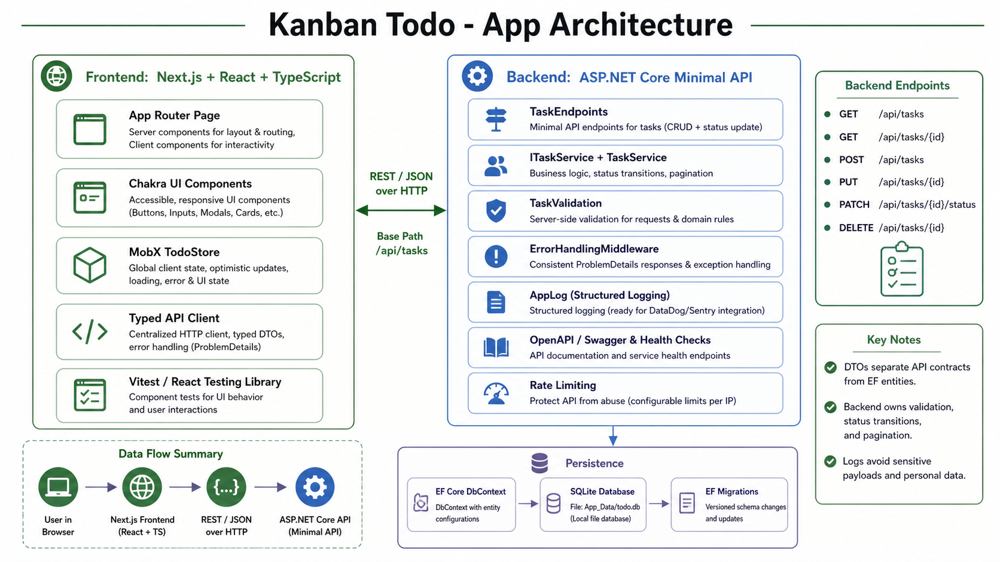

# Todo Kanban Style Task Management App



Small full-stack Kanban task management app.

The app uses a deliberately simple architecture: Next.js + React on the frontend, ASP.NET Core Minimal APIs on the backend, and SQLite through EF Core for local persistence.

## Tech Stack

- Backend: .NET 10, ASP.NET Core Minimal APIs, C#
- Database: SQLite, EF Core, EF migrations
- API: REST, JSON, OpenAPI document in development
- Frontend: Next.js App Router, React, TypeScript
- UI/state: Chakra UI, MobX
- Forms/validation: React Hook Form, Zod, server-side validation
- Tests: xUnit, WebApplicationFactory, Vitest, React Testing Library

## Prerequisites

- .NET SDK 10
- Node.js 24+
- pnpm 10+

## Quick Start

From the repo root:

```bash
./dev.sh
```

The script installs/restores backend and frontend packages, creates `frontend/.env.local` from `.env.example` when needed, starts the backend on `http://localhost:5000`, starts the frontend on `http://localhost:3000`.
Note: Assuming you have pnpm installed

## Backend Setup

Manual backend setup:

```bash
cd backend
dotnet restore
dotnet tool restore
dotnet tool run dotnet-ef database update --project Kanban.Todo.Api
dotnet run --project Kanban.Todo.Api --urls http://localhost:5000
```

Backend URLs:

- API health: `http://localhost:5000/health`
- OpenAPI JSON: `http://localhost:5000/openapi/v1.json`
- Tasks API: `http://localhost:5000/api/tasks`

SQLite database path:

```text
backend/Kanban.Todo.Api/App_Data/todo.db
```

In development, the API also runs EF migrations on startup so local setup stays low-friction. In production, migrations should run as an explicit deployment step.

## Frontend Setup

Manual frontend setup in a second terminal:

```bash
cd frontend
pnpm install
cp .env.example .env.local
pnpm dev
```

The frontend runs at:

```text
http://localhost:3000
```

Default frontend API URL:

```text
NEXT_PUBLIC_API_BASE_URL=http://localhost:5000
```

## Tests

Backend:

```bash
cd backend
dotnet test
```

Frontend:

```bash
cd frontend
pnpm lint
pnpm exec tsc --noEmit
pnpm test
```

Current verified coverage includes backend service behavior, endpoint behavior, API client request shape, MobX store workflow, form validation, dashboard loading/error retry, create/edit/delete UI flows, and drag/drop behavior.

## API Overview

Base path:

```text
/api/tasks
```

Endpoints:

```text
GET    /api/tasks?page=1&pageSize=50
GET    /api/tasks/{id}
POST   /api/tasks
PUT    /api/tasks/{id}
PATCH  /api/tasks/{id}/status
DELETE /api/tasks/{id}
```

Create example:

```bash
curl -X POST http://localhost:5000/api/tasks \
  -H "Content-Type: application/json" \
  -d '{"title":"Review care plan","description":"Confirm due date","priority":"High","status":"Todo","dueDate":"2026-07-01T00:00:00Z"}'
```

Move status example:

```bash
curl -X PATCH http://localhost:5000/api/tasks/{id}/status \
  -H "Content-Type: application/json" \
  -d '{"status":"Done"}'
```

## Architecture Notes

### Backend

```text
backend/Kanban.Todo.Api/
  Program.cs
  Contracts/
  Data/
  Domain/
  Features/Tasks/
  Infrastructure/
  Middleware/
  Migrations/
  Validation/
```

- `Program.cs` wires OpenAPI, ProblemDetails, CORS, rate limiting, EF Core, migrations in development, and endpoint registration.
- `Contracts/` contains request/response DTOs. EF entities are not returned directly.
- `Domain/` contains `TaskItem`, `TaskPriority`, and `TaskStatus`.
- `Data/TodoDbContext.cs` owns EF mapping, indexes, and SQLite timestamp conversion.
- `Features/Tasks/TaskEndpoints.cs` maps the REST routes with typed Minimal API results.
- `Features/Tasks/TaskService.cs` owns task workflow logic and DTO projection.
- `Validation/TaskValidation.cs` centralizes command validation and enum parsing.
- `Middleware/ErrorHandlingMiddleware.cs` returns safe problem details without stack traces.
- `Infrastructure/AppLog.cs` centralizes structured logging so later Sentry/Datadog/OpenTelemetry integration has one obvious place to start.

EF Core is used directly instead of a repository abstraction. For this app size, `DbContext` is already the practical unit-of-work abstraction.

SQLite `DateTimeOffset` values are stored as UTC ticks so ordering remains reliable through EF Core.

### Frontend

```text
frontend/
  app/
  components/ui/
  features/tasks/
  hooks/
  lib/
  util/
  stores/
  tests/
  types/
```

- `app/layout.tsx` provides the Chakra provider and global app shell.
- `app/page.tsx` renders the dashboard.
- `components/ui/` contains Chakra-backed reusable UI primitives.
- `features/tasks/` contains the Kanban board, cards, forms, dialogs, and drag/drop behavior.
- `stores/todo.store.ts` is the MobX store for the board workflow.
- `lib/api.ts` contains the typed tasks API client.
- `lib/apiClient.ts` wraps `fetch`, parses problem details, and normalizes API/network errors.

The board has three fixed columns: `Todo`, `InProgress`, and `Done`. Tasks are created in a selected column, edited in a dialog, moved with native HTML drag-and-drop, and deleted after confirmation.

## Assumptions

- This is a single-user demo app.
- No PHI/PII should be stored in tasks.
- Hard delete is acceptable for the MVP.
- Local development CORS allows only `http://localhost:3000`.
- SQLite is selected for MVP for simplicity.
- The backend owns validation, status transitions, timestamps, pagination bounds, and API error shape.

## Security Notes

- There is no authentication or authorization in this demo.
- `AllowedHosts` is restricted to local hosts by default and should be environment-specific in deployment.
- A modest global rate limiter is configured for the task API surface.
- Unexpected errors return generic problem details and do not leak stack traces.
- Logs should avoid task descriptions and any sensitive payloads.
- The SQLite native dependency is pinned to a patched package version to avoid the previously reported vulnerable transitive package.

For real workloads, production controls would need HIPAA-aware access control, audit logging, encryption, secure secret management, retention policies, incident response workflows, least-privilege infrastructure, and observability.

## Scalability Notes

- SQLite is fine for this MVP but not the long-term production database for a high-scale product.
- SQL Server or PostgreSQL would be preferred for production concurrency, backups, operations, and indexing.
- The current list endpoint returns newest tasks first with pagination. If task volume grows, cursor pagination would be a better fit than page/offset pagination.
- EF access is isolated enough that switching database providers later would be straightforward.

## Future Improvements

- Authentication and authorization
- User-owned tasks
- Audit log
- Soft delete or retention policy
- Optimistic concurrency token
- SQL Server/PostgreSQL migration
- Dockerized deployment
- CI pipeline for build, lint, tests, and vulnerability scan
- Playwright end-to-end tests
- Request correlation IDs
- OpenTelemetry tracing and metrics
- Stronger deployment-time migration workflow
- Accessibility pass with keyboard drag alternatives if drag/drop becomes core UX
